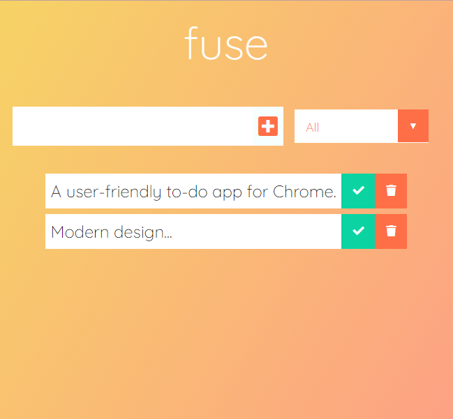
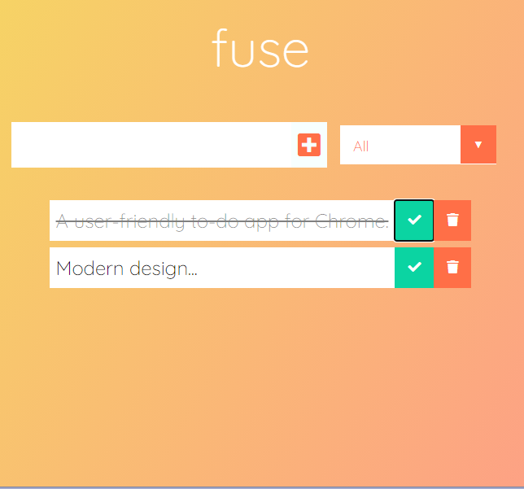
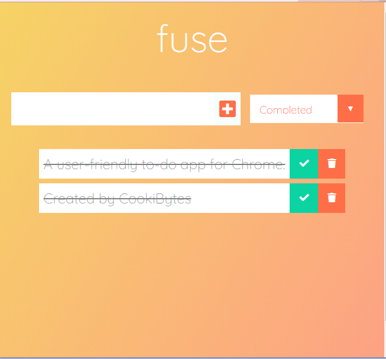
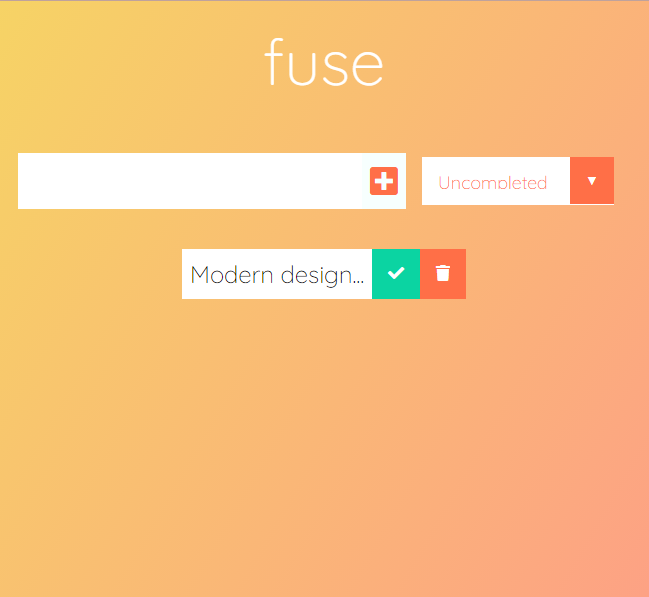

**fuse** is a modern-themed to-do Chrome Extension.

# Images (Preview)

# Documentation

> **Step 1.** Clone this project by clicking on the `Code` button with the green background, and click `Download Zip`.

> **Step 2.** Next, go to your folder explorer and right click and click, `Extract All`.

> **Step 3.** Now go to your Chrome extensions page (in Chrome or Brave) and then toggle **on** Developer Mode.

> **Step 4.** Click `Load unpacked` and go to the `todo-extension` folder and then click the `build` folder.

Good to go 👍
